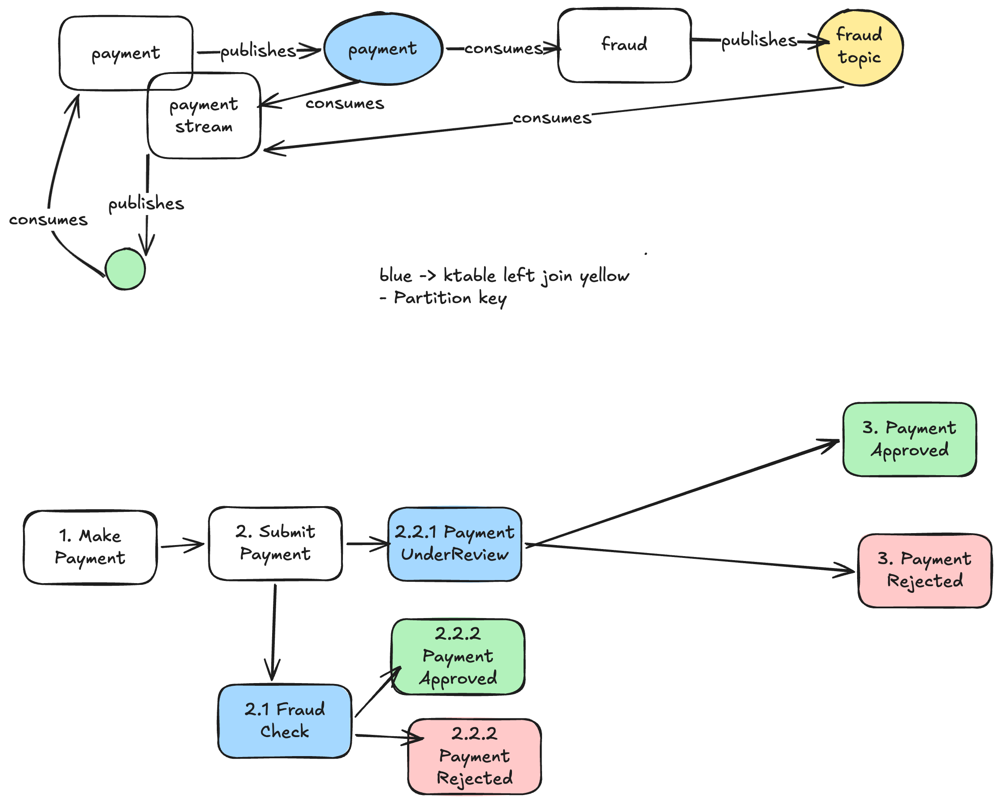

# ZPayment

It's a multi-module project that will emulate a payment that will be passed throught a fraud check.

Each module a part from `avros`, will represent a different microservice.

Java -> 25
SB -> 4.x
Jackson -> 3.x

# Arch view

## Payment Module

Consider that an microservice that will manage payment processing and state according with the fraud-check performed agains a "third-party" via `fraud-gateway` module.

How does it work:
- Payment module submit a payment and wait for the result from `fraud-gateway` module.
- If fraud is detected, payment is rejected.
- If fraud is not detected, payment is approved.

*Idempotency key is necessary to ensure the payment won't be processed multiple times.*

The service is implemented using Spring Boot and Apache Kafka for message-driven architecture. It consumes payment submission events from Kafka topic and sends them to the fraud gateway for fraud detection. The result is then processed and stored in a database.

Contract First approach can be seen here: https://github.com/iagoquirino/zpayment/blob/main/payment/src/main/resources/api/v1.yaml

States:
 - PENDING -> Payment accepted and submitted
 - UNDER_REVIEW -> Payment is under review by fraud gateway
 - REJECTED -> Payment rejected by fraud gateway
 - APPROVED -> Payment approved by fraud gateway

## Fraud Gateway Module

Consider as a microservice that will perform fraud detection against a third-party service, the calls were emulated via wiremock.

It consumes payment submission events from Kafka topic and sends them to the fraud gateway for fraud detection. Once checked an event will be emitted to esure the fraud was executed for each payment.

Assumptions:
 - No database involved in this module, so nothing will be persisted intentionally
 - No circuit breaker or retry mechanism at all
 - Rejected scenarios for when informed 999 or 9.99

## Avros

For simplicity we will use common module to have avro schemas shared between microservices.

In real world would be retrieved the avros from schema registry.

e.g `fraud-gateway` would contain only [fraud_payment_result.avdl](avros/src/main/resources/avro/fraud/fraud_payment_result.avdl)
and the [payment_submitted.avdl](avros/src/main/resources/avro/payment/payment_submitted.avdl) would be pulled from SC.

## How to run
- ./docker-compose up -d
- Start payment module on 8080
- Start fraud-gateway module on 8082
